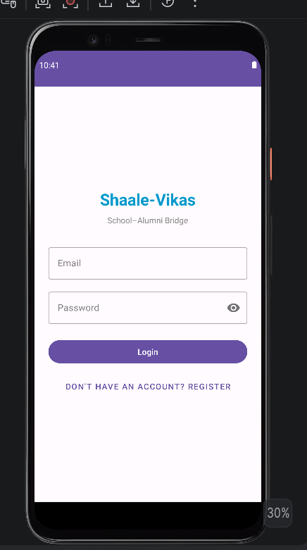
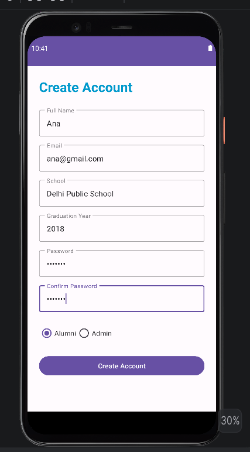
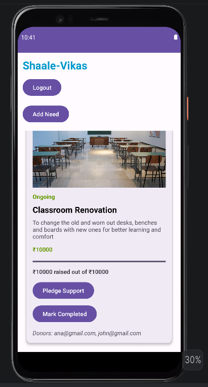
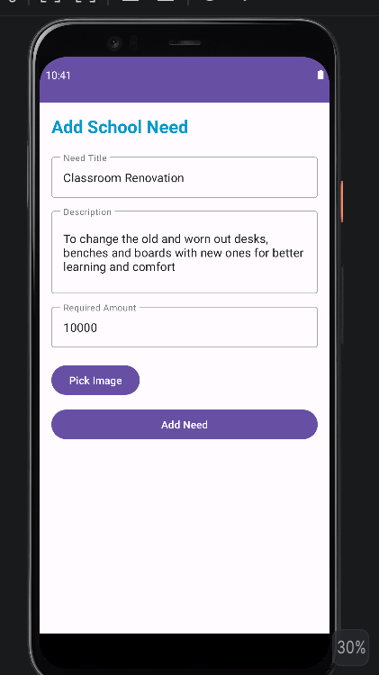
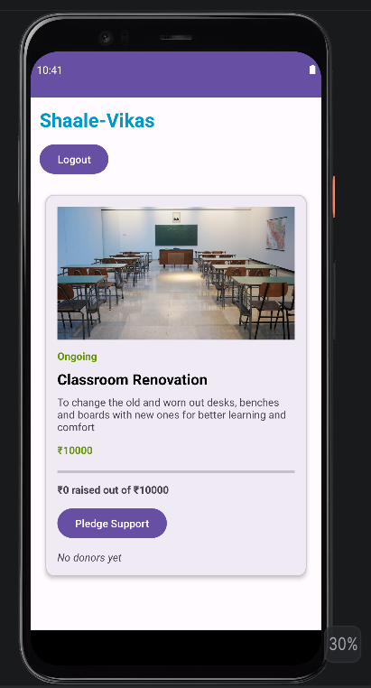
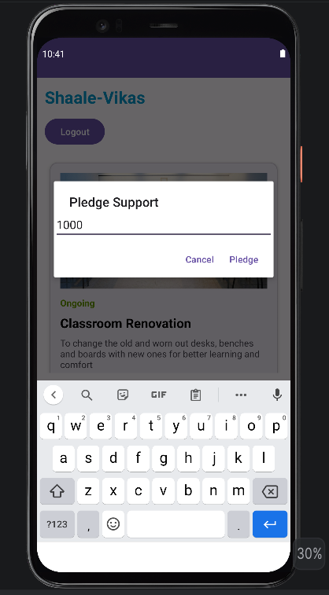
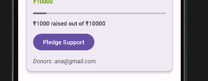
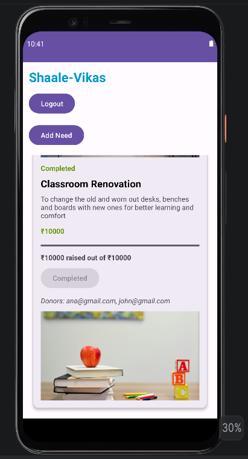
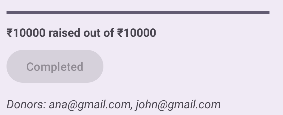

# Shaale-Vikas 

## Community Crowdfunding Platform for School Development

Shaale-Vikas is an Android-based community crowdfunding platform designed to help schools raise support for infrastructure and educational needs through alumni contributions.

The platform enables school administrators to post school requirements such as classroom repairs, library improvements, benches, sports equipment, and other educational needs, while alumni can pledge financial support and track the progress of each initiative.

---

# Problem Statement

Many schools face difficulties in funding infrastructure improvements and educational resources. Alumni often wish to contribute back to their schools but often lack a transparent and organized platform to do so.

Shaale-Vikas bridges this gap by creating a centralized system where:

* Schools can post their needs
* Alumni can contribute funds
* Progress can be tracked transparently
* Impact can be visually demonstrated

---

# Features

## Authentication System

* Firebase Authentication
* User Registration & Login
* Role-based Access:

  * Admin
  * Alumni

---

## Admin Features

* Add school needs
* Add descriptions and funding targets
* Add need images
* Track donations
* Mark needs as completed
* Add after-completion impact images

---

## Alumni Features

* View all school needs
* Pledge custom donation amounts
* View funding progress
* View donor contributions
* Track completed projects

---

## Dashboard Features

* RecyclerView-based dynamic dashboard
* Real-time Firebase Realtime Database updates
* Progress bars for fundraising
* Donor Hall of Fame
* Before and After impact images
* Completion status tracking

---

# Tech Stack

| Technology                 | Purpose                    |
| -------------------------- | -------------------------- |
| Kotlin                     | Android App Development    |
| Android Studio             | Development Environment    |
| Firebase Authentication    | User Login & Registration  |
| Firebase Realtime Database | Real-time Data Storage     |
| Glide                      | Image Loading              |
| MVVM Architecture          | Clean Architecture Pattern |
| RecyclerView               | Dynamic Dashboard UI       |
| Material Design Components | Modern UI Design           |

---

# Architecture

The application follows the **MVVM (Model-View-ViewModel)** architecture pattern.

## Components

### Model Layer

* Need Model
* User Model
* Pledge Model

### View Layer

* Fragments
* RecyclerViews
* XML Layouts

### ViewModel Layer

* Authentication ViewModel
* Home ViewModel
* AddNeed ViewModel
* NeedDetail ViewModel

### Repository Layer

* Firebase Realtime Database interactions
* Authentication handling

---

# Firebase Integration

## Firebase Services Used

* Firebase Authentication
* Firebase Realtime Database

## Database Features

* Persistent storage
* Real-time updates
* Shared synchronization across users

---

# Image Handling

The application supports:

* Need images
* Completion/impact images
* Glide-based image loading

Currently, image URLs are used for demonstration purposes. The production implementation can be extended using Firebase Storage for direct image uploads.

---

# Screenshots

## Login Screen

## Registration Screen

## Admin Dashboard

## Add Need Screen

## Alumni Dashboard

## Pledge Popup

## Progress Tracking

## Completed Need with After Image

## Donor Hall of Fame

---

# Project Workflow

## Admin Workflow

Add Need → Upload Image → Track Donations → Mark Completed → Add Impact Image

## Alumni Workflow

View Needs → Pledge Support → Track Progress → View Completed Projects

---

# Future Enhancements

* Firebase Storage integration
* Push notifications
* Razorpay/UPI payment gateway
* Dark mode
* Analytics dashboard
* School verification system
* Comment and discussion section

---

# Developed By

**Shreya Jadhav**

---

# License

This project is developed for educational and internship demonstration purposes.
